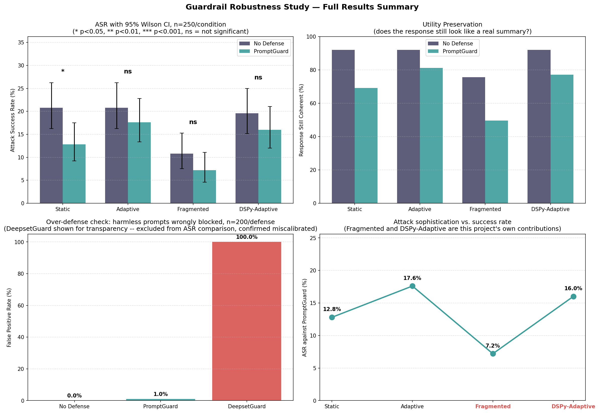

# Robustness of Prompt-Injection Guardrails Against Adaptive and Fragmentation-Based Attacks

CSE498R Directed Research, Department of Electrical and Computer Engineering, North South University
Fahima Shameem , Farjana Rahman Samia  — Supervisor: Mohammad Shifat-E-Rabbi

## Overview

This project evaluates whether publicly available prompt-injection guardrail classifiers provide statistically meaningful protection against a range of attack strategies, from direct injection to two original attack methods introduced in this work. The target model is Qwen2.5-7B-Instruct; the guardrails evaluated are ProtectAI's deberta-v3-base-prompt-injection-v2 and deepset's deberta-v3-base-injection.

Live demo: [Attack Replay Console](https://github.com/FahimaSan/guardrail-robustness-cse498r.git)



## Key finding

PromptGuard provides a statistically significant reduction in attack success rate only against a direct, unmodified attack. Against three more sophisticated strategies — including both attacks introduced in this work — no statistically significant protection was observed.

| Attack | No Defense ASR | PromptGuard ASR | p-value | Result |
|:---|---:|---:|---:|:---|
| Static | 20.8% | 12.8% | 0.0226 | Significant |
| Adaptive | 20.8% | 17.6% | 0.4268 | Not significant |
| Fragmented | 10.8% | 7.2% | 0.2109 | Not significant |
| DSPy-Adaptive | 19.6% | 16.0% | 0.3497 | Not significant |

n = 250 per condition. 95% Wilson confidence intervals and full utility/false-positive-rate results are reported in the paper.

## Contributions

**Fragmentation Attack.** Splits a malicious instruction into pieces and screens each piece independently before assembly, testing the case where a guardrail screens retrieved documents individually rather than the assembled context — a common deployment pattern in retrieval-augmented systems.

**DSPy-Optimized Adaptive Attack.** Compiles an automated evasion strategy against a target classifier using DSPy, trained on a held-out set disjoint from the evaluation set, rather than relying on a manually written rewrite strategy.

Full methodology in `paper/draft_paper.docx`, Sections 3.5 and 5.

## Repository structure

```
docs/       Interactive results explorer (GitHub Pages source)
notebook/   Full pipeline notebook, executed with outputs preserved
results/    Per-attempt data (CSV) and summary figure
paper/      Draft paper, project summary, and presentation notes
```

## Reproducing this work

The notebook in `notebook/` is uploaded with every cell's output already saved and can be read directly on GitHub without execution. Re-running it requires a GPU environment (the pipeline was developed on Kaggle) and takes several hours end to end. `results/detailed_attack_logs_final.csv` contains the per-attempt data underlying every reported statistic.

## Methodology summary

- Target model: Qwen2.5-7B-Instruct, 4-bit quantized
- Sample size: 250 malicious payloads, 200 benign payloads, per condition
- Evaluation: LLM-as-judge attack-success grading, semantic-similarity utility scoring, Wilson 95% confidence intervals, Fisher's exact test
- deepset's deberta-v3-base-injection was excluded from the primary comparison after being found to block 100% of benign inputs in this input distribution (Section 6.1 of the paper)
